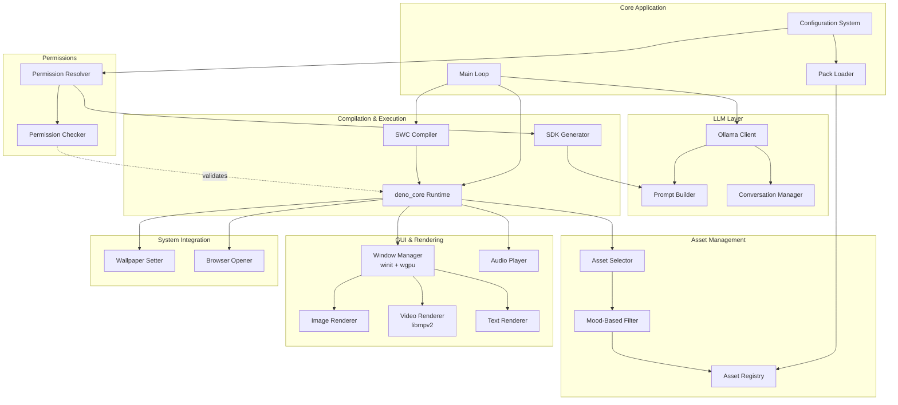
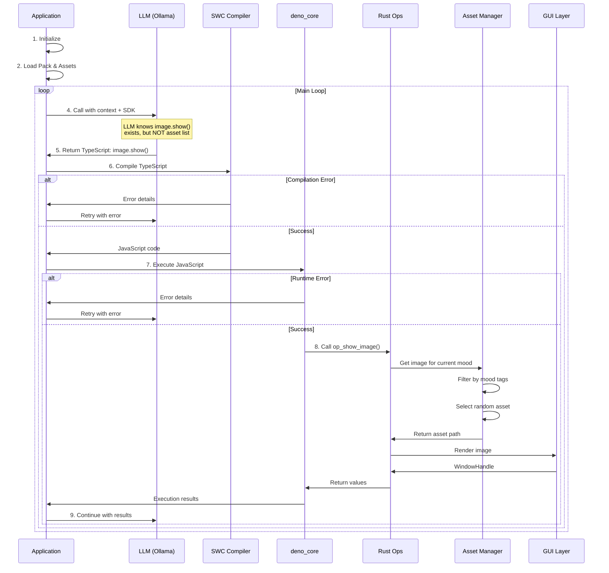
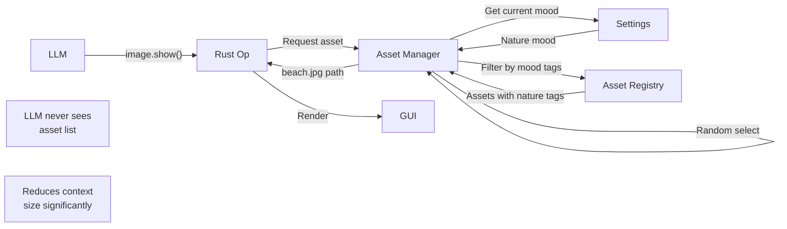
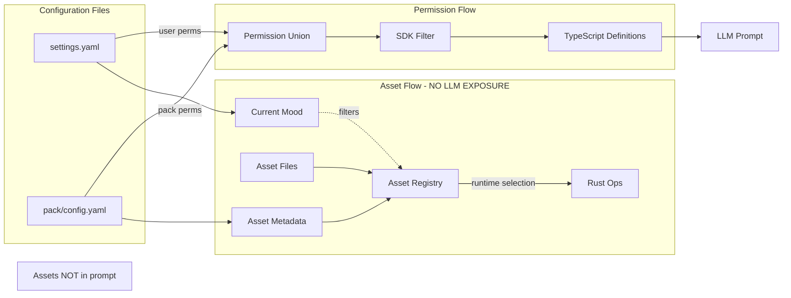
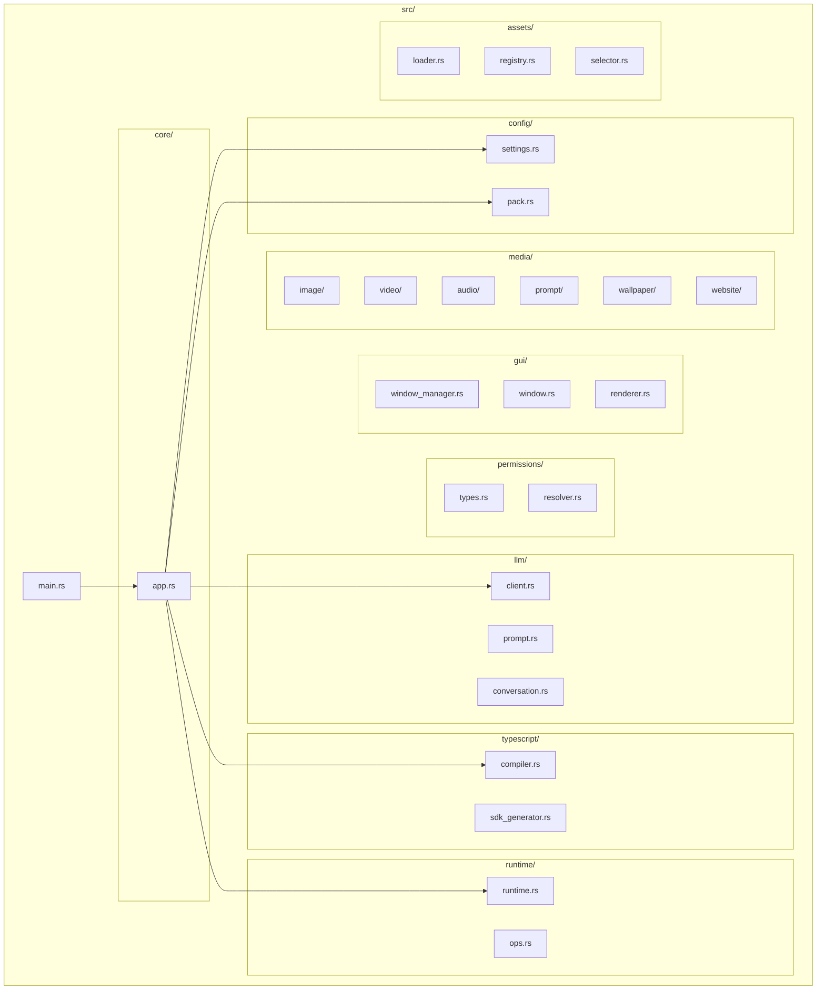
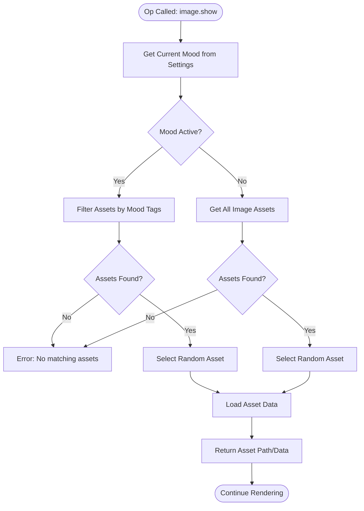
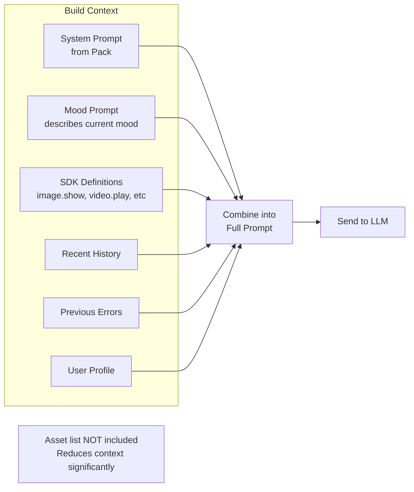

## Overview
This document outlines the architecture for goon.ai, a Rust-based background process that spawns GUI elements controlled by an LLM through TypeScript execution.
## System Architecture

## Application Flow

## Asset Selection Flow (Key Architecture Change)

## Component Interaction

## Module Structure

## Data Flow: Asset Selection at Runtime

## LLM Context Building (Simplified - No Assets)

## Dependencies
```mermaid
graph LR
    subgraph "Core"
        Tokio[tokio]
        Serde[serde]
        Anyhow[anyhow]
        Tracing[tracing]
    end

    subgraph "LLM"
        OllamaRS[ollama-rs]
    end

    subgraph "TypeScript/JS"
        SWC[swc]
        DenoCore[deno_core]
    end

    subgraph "GUI/Graphics"
        Winit[winit]
        Wgpu[wgpu]
        Libmpv[libmpv2]
        Image[image]
        Text[cosmic-text]
    end

    subgraph "Audio"
        Rodio[rodio]
    end

    subgraph "System"
        Open[open]
        URL[url
