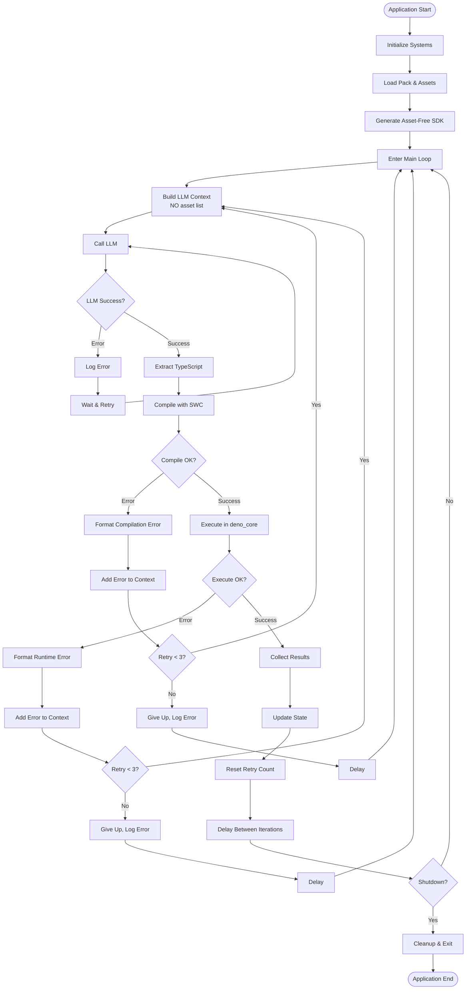
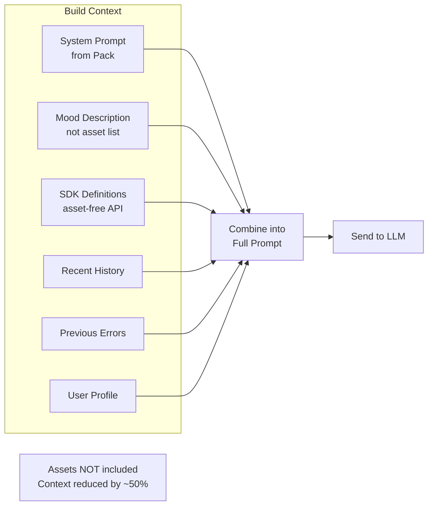
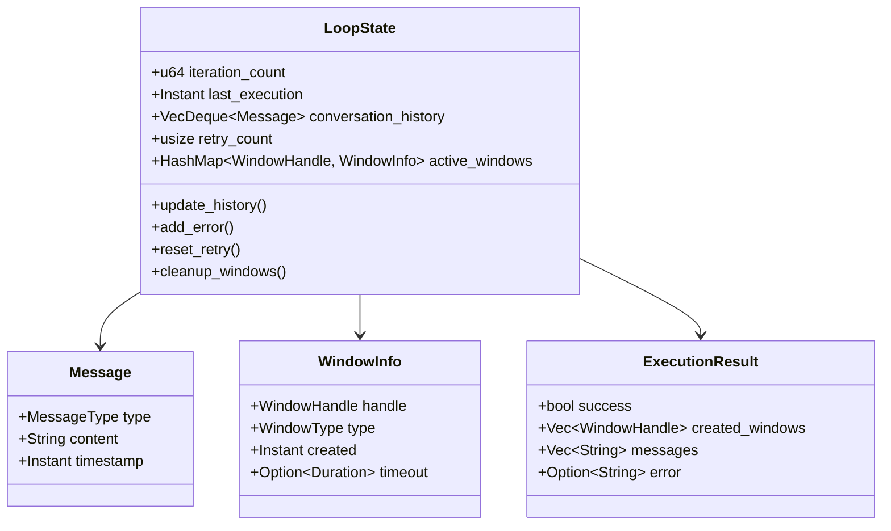
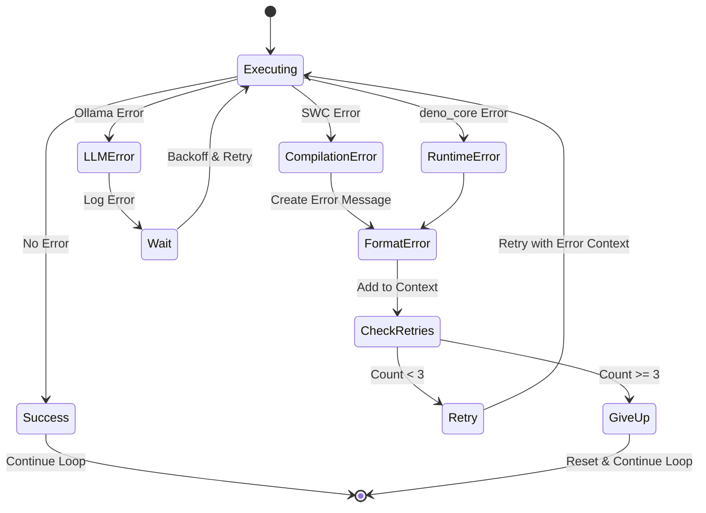
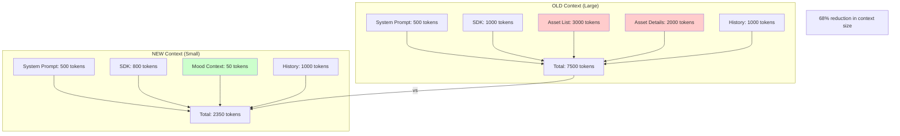
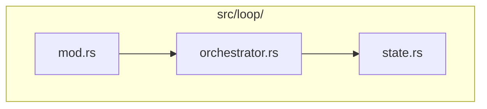

## Objective
Implement the main application loop that coordinates LLM interactions, TypeScript compilation, and code execution with **asset-free prompts** for reduced context size.
## Main Loop Flow

## Context Building (Simplified - No Assets)

## Complete Execution Flow with Asset Selection
```mermaid
sequenceDiagram
    participant Loop as Main Loop
    participant LLM as Ollama
    participant SWC as Compiler
    participant Deno as deno_core
    participant Op as op_show_image
    participant Selector as AssetSelector
    participant GUI as Window Manager

    Note over Loop: Build context (no assets)
    Loop->>LLM: Prompt with SDK + mood context
    Note over LLM: Knows image.show() exists<br/>NOT which images available
    LLM->>Loop: await image.show()

    Loop->>SWC: Compile TypeScript
    SWC->>Loop: JavaScript code

    Loop->>Deno: Execute JS
    Deno->>Op: op_show_image()

    Note over Op: NOW assets are selected
    Op->>Selector: Get image for current mood
    Selector->>Selector: Filter by mood tags
    Selector->>Selector: Random select
    Selector->>Op: beach.jpg

    Op->>GUI: Display beach.jpg
    GUI->>Op: WindowHandle
    Op->>Deno: Return handle
    Deno->>Loop: Success

    Note over Loop: Add result to history
    Loop->>Loop: Wait 5 seconds
    Loop->>LLM: Continue with context
```
## State Management

## Error Handling Strategy

## Retry Mechanism with Asset-Free API
```mermaid
sequenceDiagram
    participant Loop as Main Loop
    participant LLM as LLM
    participant Compiler as SWC
    participant Runtime as deno_core

    Note over Loop: Context: SDK with asset-free API
    Loop->>LLM: Request TypeScript
    LLM->>Loop: await image.show("beach.jpg")

    Loop->>Compiler: Compile
    Compiler->>Loop: Error: image.show takes no path arg

    Note over Loop: Retry #1, Add error to context

    Loop->>LLM: Error: image.show() doesn't take paths<br/>Assets selected automatically by mood
    LLM->>Loop: await image.show()

    Loop->>Compiler: Compile
    Compiler->>Loop: Success (JS code)

    Loop->>Runtime: Execute
    Note over Runtime: op selects asset by mood
    Runtime->>Loop: Success (WindowHandle)

    Note over Loop: Reset retry count
```
## Context Size Optimization

## Module Structure

## Timing and Performance
```mermaid
gantt
    title Typical Loop Iteration (Asset-Free)
    dateFormat X
    axisFormat %Lms

    section LLM
    Build context (no assets) :0, 30
    Call LLM :30, 1800
    Parse response :1800, 1850

    section Compilation
    Compile TS :1850, 1900

    section Execution
    Execute JS :1900, 1920
    Select asset by mood :1920, 1950
    Render asset :1950, 2000
    Collect results :2000, 2050

    section Delay
    Inter-iteration delay :2050, 5050
```
## Tasks
### 1. Loop Module Structure
- [ ] Create loop module (see diagram)
- [ ] Define module exports
### 2. Application Loop Flow
- [ ] Implement main loop (see flowchart)
- [ ] Handle all error cases
- [ ] Implement retry logic
### 3. Context Building (Simplified)
- [ ] Build context WITHOUT asset lists
- [ ] Include mood description only
- [ ] Include asset-free SDK
- [ ] Manage context window size
- [ ] Prioritize recent information
### 4. Error Handling Loop
- [ ] Retry mechanism (max 3)
- [ ] Format errors for LLM
- [ ] Track retry count
- [ ] Handle "wrong API usage" errors
### 5. Execution Results
- [ ] Collect results from ops
- [ ] Format for LLM feedback
- [ ] Update conversation history
- [ ] Note which assets were actually used
### 6. Loop Control
- [ ] Start/stop/pause
- [ ] Configurable delays
- [ ] Graceful shutdown
- [ ] Handle Ctrl+C
### 7. State Management
- [ ] Track loop state
- [ ] Manage conversation history
- [ ] Track active windows
- [ ] Track current mood
### 8. Logging and Monitoring
- [ ] Log each iteration
- [ ] Performance metrics
- [ ] Error tracking
- [ ] Asset selection tracking
### 9. Graceful Degradation
- [ ] Handle subsystem failures
- [ ] Continue on non-critical errors
- [ ] Stop on critical errors
### 10. Startup Sequence
- [ ] Initialize all systems
- [ ] Load pack and assets
- [ ] Generate asset-free SDK
- [ ] Validate before starting
- [ ] Enter main loop
### 11. Shutdown Sequence
- [ ] Stop loop gracefully
- [ ] Close all windows
- [ ] Cleanup resources
- [ ] Save state (future)
### 12. Async Coordination
- [ ] Coordinate with tokio
- [ ] Handle async operations
- [ ] Window event integration
## Example Iteration with Asset-Free API
```mermaid
sequenceDiagram
    participant Loop as Main Loop
    participant LLM as Ollama
    participant SWC as Compiler
    participant Deno as Runtime
    participant Assets as Asset Selector
    participant GUI as Window Manager

    Note over Loop: Iteration 1 (Context: ~2500 tokens)
    Loop->>LLM: Show relaxing content (mood: Nature)
    LLM->>Loop: await image.show({ duration: 10 })
    Loop->>SWC: Compile
    SWC->>Loop: JS code
    Loop->>Deno: Execute
    Deno->>Assets: Get image for Nature mood
    Assets->>Deno: forest.jpg
    Deno->>GUI: Display forest.jpg
    GUI->>Deno: WindowHandle
    Deno->>Loop: Success

    Note over Loop: Wait 5 seconds (Context: ~2600 tokens)

    Note over Loop: Iteration 2
    Loop->>LLM: Continue (with previous result)
    LLM->>Loop: await video.play({ loop: true })
    Loop->>SWC: Compile
    SWC->>Loop: JS code
    Loop->>Deno: Execute
    Deno->>Assets: Get video for Nature mood
    Assets->>Deno: jellyfish.mp4
    Deno->>GUI: Play jellyfish.mp4
    GUI->>Deno: WindowHandle
    Deno->>Loop: Success
```
## Acceptance Criteria
- [ ] Loop runs continuously
- [ ] LLM integration works with reduced context
- [ ] Compilation errors handled and reported
- [ ] Runtime errors handled and reported
- [ ] Retry mechanism works (max 3 retries)
- [ ] Context properly maintained WITHOUT assets
- [ ] Results fed back to LLM
- [ ] Graceful startup and shutdown
- [ ] Logging provides visibility
- [ ] Performance is acceptable
- [ ] **Context size reduced by ~50-70%**
- [ ] **Asset selection transparent to LLM**
## Dependencies
```mermaid
graph TB
    Issue2[#2 Core Init] -->|required| This[Issue #16]
    Issue3[#3 Asset Loading] -->|required| This
    Issue4[#4 LLM] -->|required| This
    Issue5[#5 TypeScript] -->|required| This
    Issue6[#6 deno_core] -->|required| This
    Issue7[#7 SDK] -->|required| This
    Issue8[#8 Permissions] -->|required| This
    Issue9[#9 GUI] -->|required| This
    Issue10[#10 Image] -->|required| This
    Issue11[#11 Video] -->|required| This
    Issue12[#12 Audio] -->|required| This
    Issue13[#13 Prompt] -->|required| This
    Issue14[#14 Wallpaper] -->|required| This
    Issue15[#15 Website
