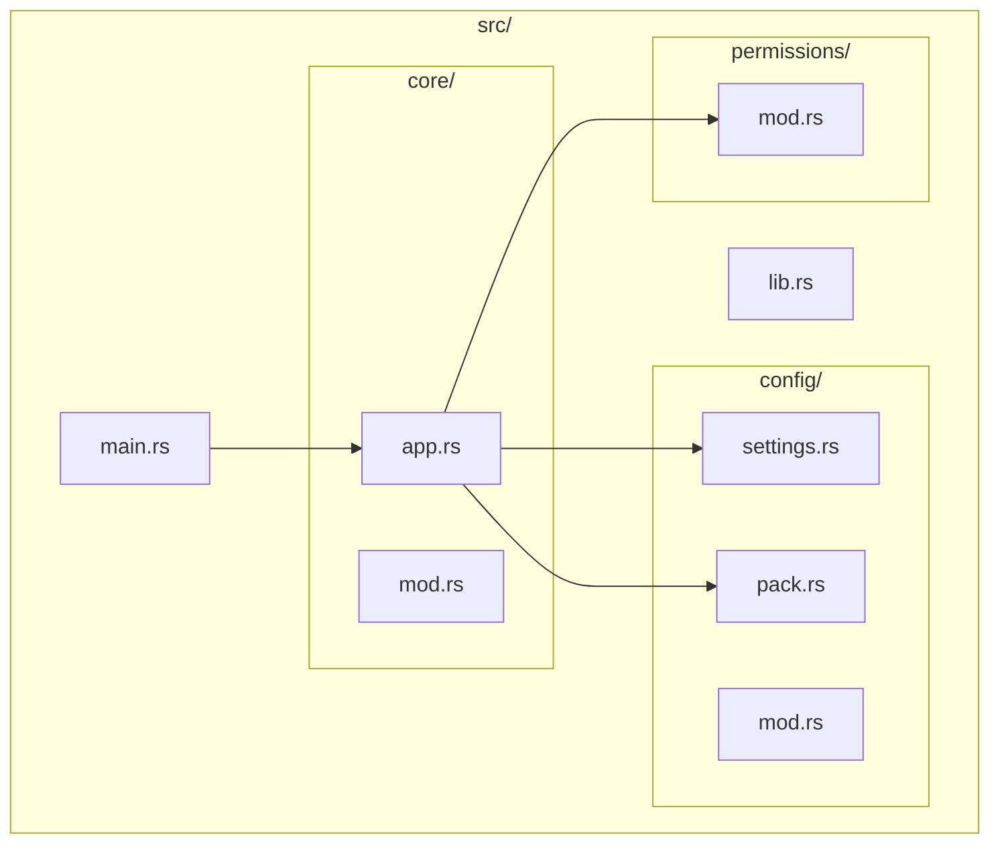
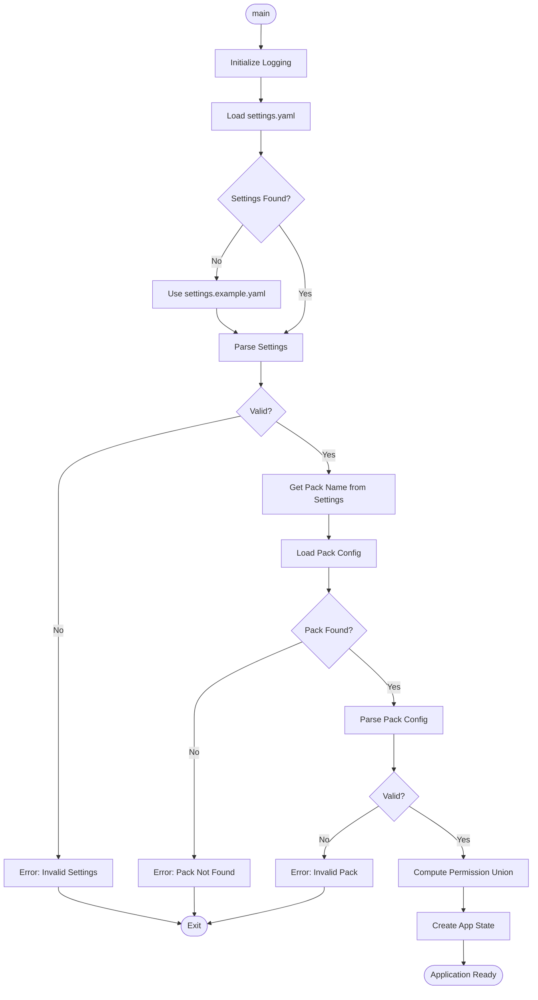
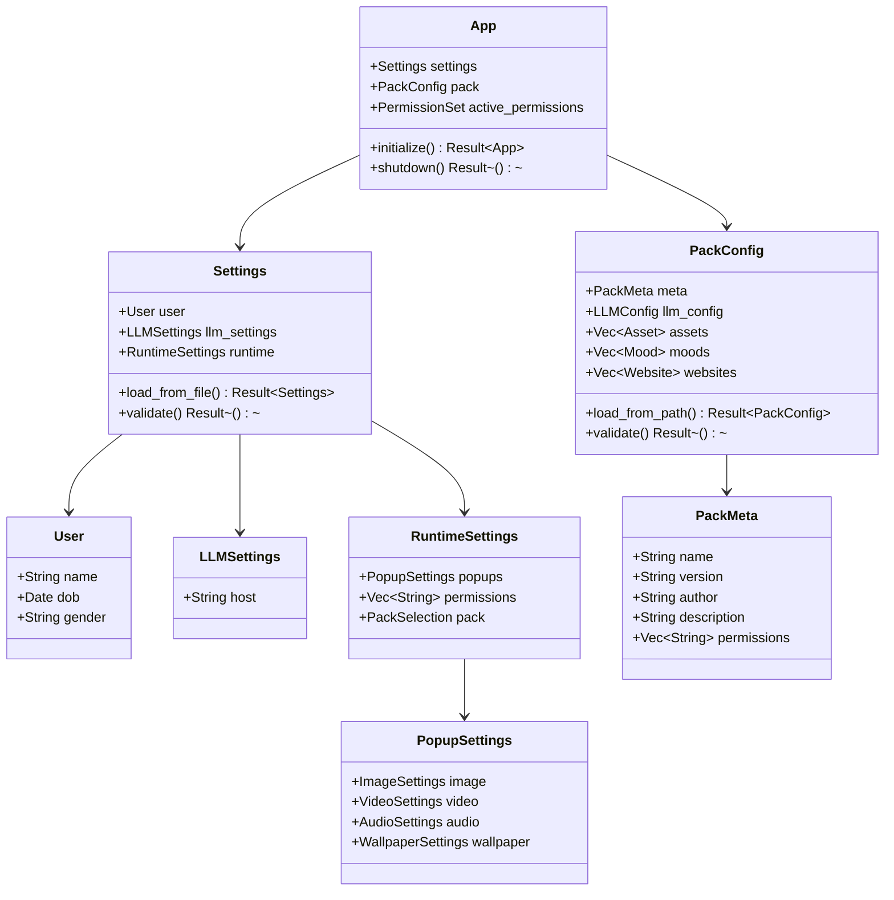
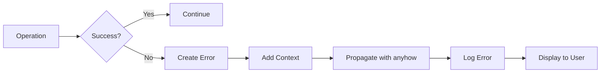
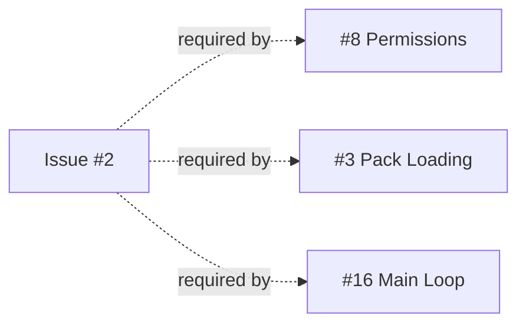

## Objective
Implement the core application initialization system that loads configuration files and prepares the runtime environment.
## Module Structure

## Initialization Flow

## Configuration Data Model

## Task Workflow

```mermaid
gantt
    title Implementation Tasks
    dateFormat X
    axisFormat %s

    section Structure
    Create module structure :done, s1, 0, 1

    section Data Types
    Define Settings struct :done, s2, 1, 2
    Define PackConfig struct :done, s3, 2, 3
    Implement serde deserialize :s4, 3, 5

    section Loading
    Implement settings loader :s5, 5, 7
    Implement pack loader :s6, 7, 9

    section App State
    Create App struct :s7, 9, 10
    Implement initialization :s8, 10, 12

    section Error Handling
    Define error types :s9, 12, 13
    Add error context :s10, 13, 14

    section Logging
    Setup tracing :s11, 14, 15
    Add log points :s12, 15, 16
```

## Tasks
### 1. Project Structure Setup
- [ ] Create module structure (see diagram above)
- [ ] Set up `mod.rs` files with proper exports
- [ ] Create `lib.rs` for shared types
### 2. Configuration Structures
- [ ] Define `Settings` struct for settings.yaml
- [ ] Define `PackConfig` struct for pack config.yaml
- [ ] Implement serde deserialization for both
- [ ] Add validation methods
### 3. Configuration Loading
- [ ] Implement settings.yaml loader
- [ ] Implement pack loader
- [ ] Provide clear error messages for missing/invalid config
### 4. Application State
- [ ] Create `App` struct to hold runtime state
- [ ] Implement initialization sequence
- [ ] Compute permission union
### 5. Dependencies to Add
```toml
[dependencies]
tokio = { version = "1", features = ["full"] }
serde = { version = "1", features = ["derive"] }
serde_yaml = "0.9"
anyhow = "1"
tracing = "0.1"
tracing-subscriber = "0.3"
```
### 6. Error Handling
- [ ] Define custom error types
- [ ] Use `anyhow` for error propagation with context
### 7. Logging Setup
- [ ] Initialize `tracing` subscriber
- [ ] Add log points for initialization steps
## Error Handling Flow

## Acceptance Criteria
- [ ] Application can load settings.yaml and pack config.yaml
- [ ] Configuration structures properly deserialize from YAML
- [ ] Errors are clearly reported with file paths and context
- [ ] Logging provides visibility into initialization process
- [ ] Permission union is correctly computed
## Dependencies

## Related Issues
- #1 Architecture Documentation
- #8 Permissions System]
[✓] Update issue #1 with mermaid diagrams
[✓] Update issue #2 with mermaid diagrams
[ ] Update issue #3 with mermaid diagrams
[ ] Update issue #4 with mermaid diagrams
[ ] Update issue #5 with mermaid diagrams
[ ] Update issue #6 with mermaid diagrams
[ ] Update issue #7 with mermaid diagrams
[ ] Update issue #8 with mermaid diagrams
[ ] Update issue #9 with mermaid diagrams
[ ] Update issue #10 with mermaid diagrams
[ ] Update issue #11 with mermaid diagrams
[ ] Update issue #12 with mermaid diagrams
[ ] Update issue #13 with mermaid diagrams
[ ] Update issue #14 with mermaid diagrams
[ ] Update issue #15 with mermaid diagrams
[ ] Update issue #16 with mermaid diagrams
[ ] Update issue #17 with mermaid diagrams
[
