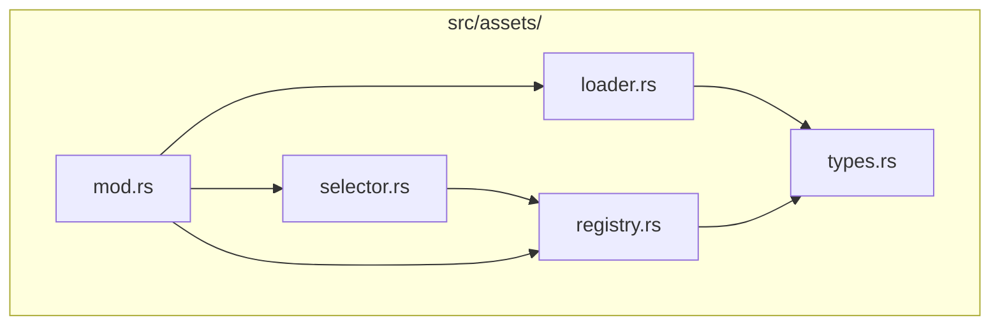
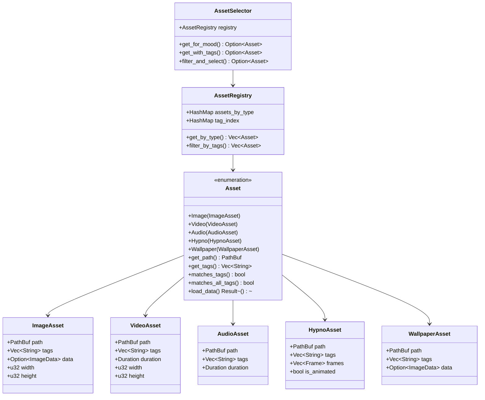
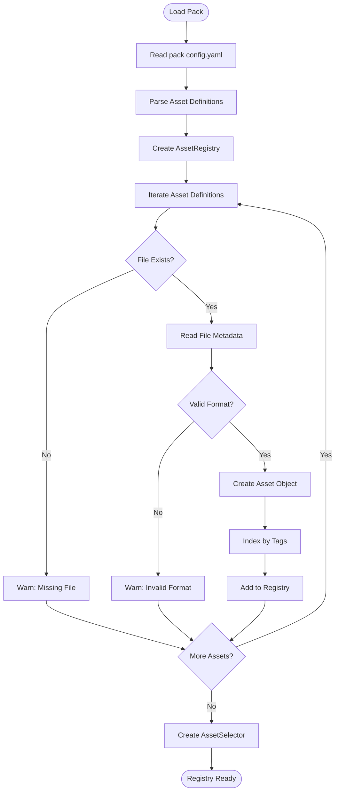
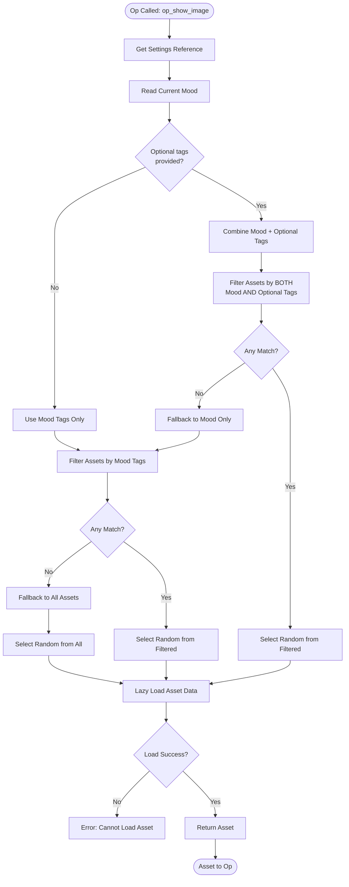
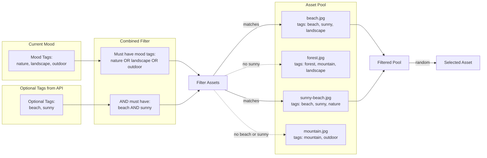
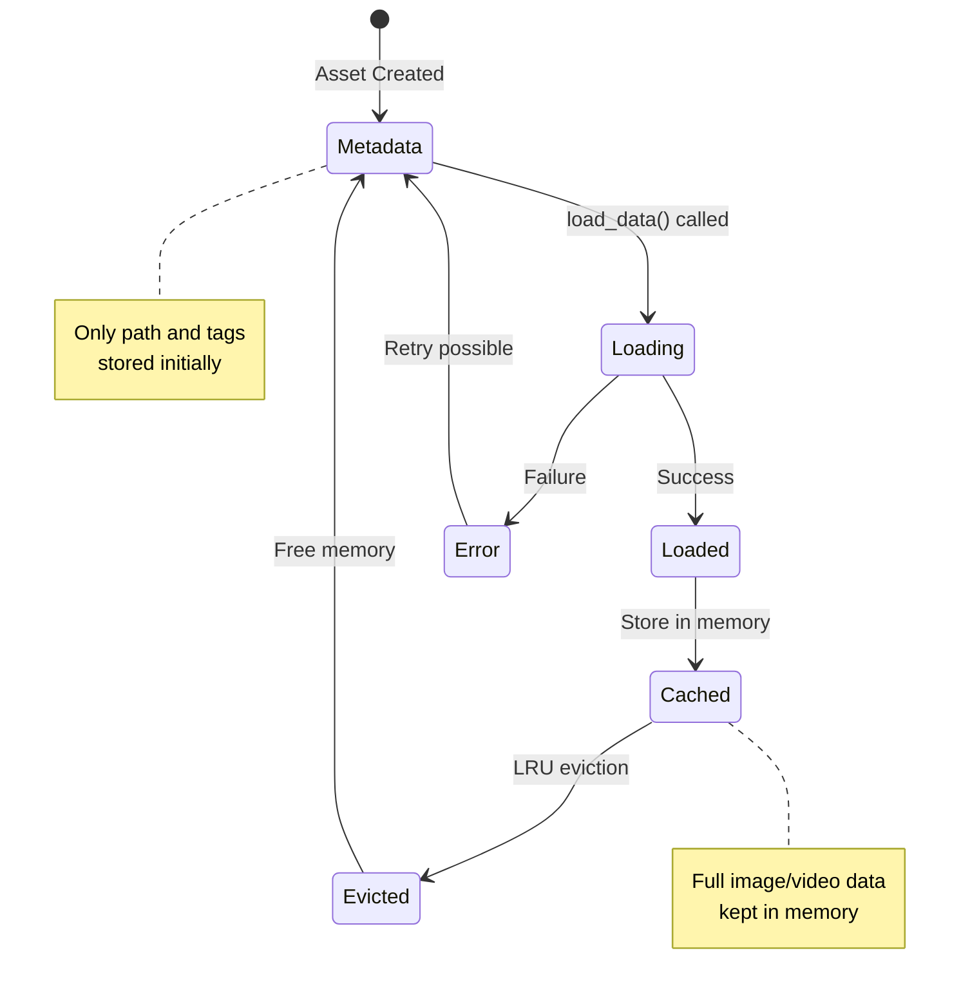
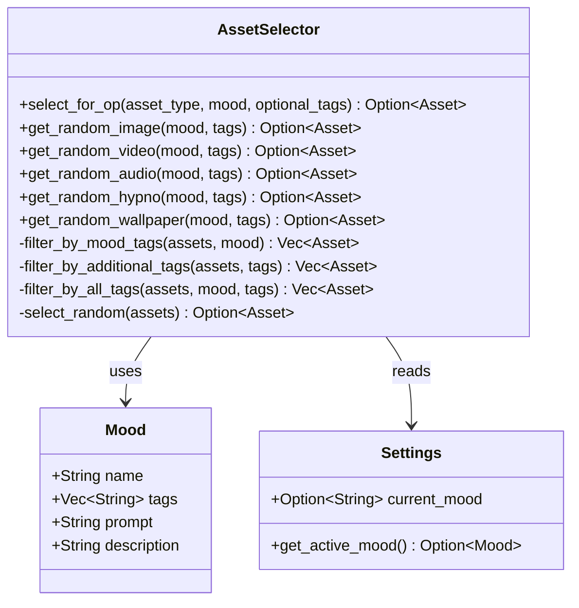
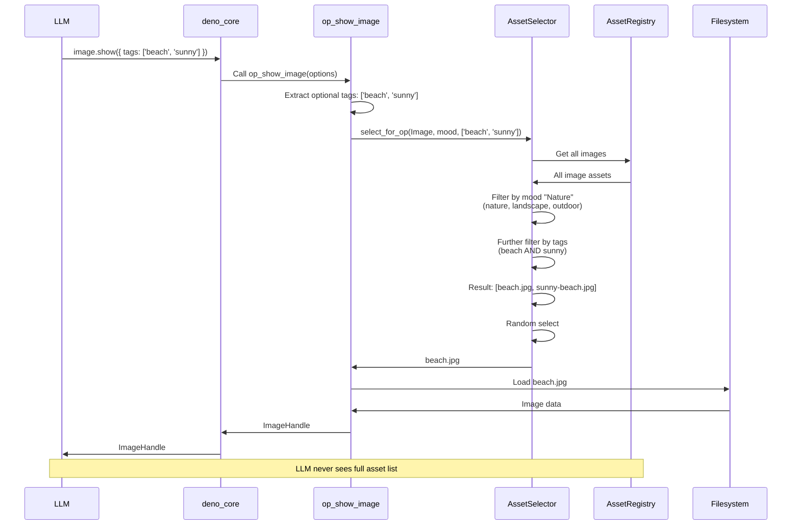
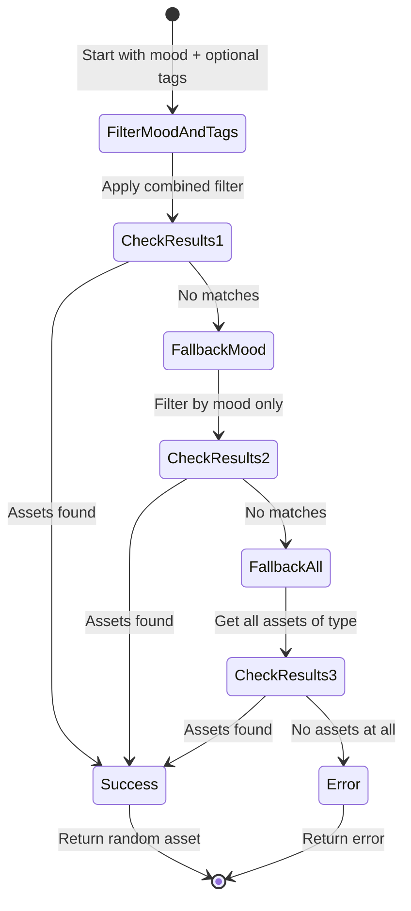
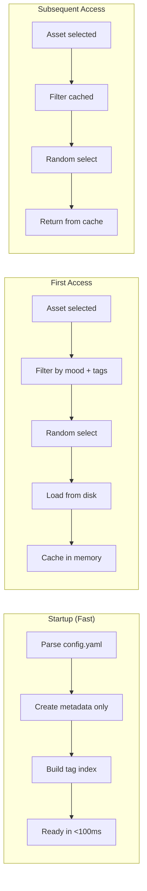

## Objective
Implement the pack asset loading system that manages images, videos, audio, hypno animations, and wallpapers with mood-based runtime selection and optional tag filtering.
## Module Structure

## Asset Type Hierarchy

## Asset Loading Flow

## Runtime Asset Selection with Optional Tags

## Tag Filtering Logic

## Mood-Based Filtering Logic
```mermaid
flowchart LR
    subgraph "Settings"
        CurrentMood[current_mood:<br/>"Nature"]
    end
    
    subgraph "Pack Moods"
        Nature[Nature Mood<br/>tags: nature, landscape, outdoor]
        Animals[Animals Mood<br/>tags: animal]
        Spirals[Spirals Mood<br/>tags: spiral]
    end
    
    subgraph "Asset Registry"
        Asset1[beach.jpg<br/>tags: beach, sunny, landscape]
        Asset2[forest.jpg<br/>tags: forest, mountain, landscape]
        Asset3[bunny.mp4<br/>tags: bunny, animal]
        Asset4[spiral.gif<br/>tags: spiral]
    end
    
    CurrentMood -->|lookup| Nature
    Nature -->|filter by tags| Filter[Tag Filter:<br/>nature OR landscape OR outdoor]
    
    Filter -->|matches| Asset1
    Filter -->|matches| Asset2
    Filter -.no match.-> Asset3
    Filter -.no match.-> Asset4
    
    Asset1 --> Pool[Filtered Asset Pool]
    Asset2 --> Pool
    Pool -->|random select| Selected[Selected Asset]
```
## Lazy Loading Strategy

## Asset Selector API

## Integration with Ops Layer

## Fallback Strategy

## Tasks
### 1. Asset Management Structure
- [ ] Create asset module structure (see diagram)
- [ ] Define module exports
### 2. Asset Type Definitions
- [ ] Define `Asset` enum with variants
- [ ] Implement asset-specific types
- [ ] Add metadata fields
- [ ] Implement `matches_tags()` method
- [ ] Implement `matches_all_tags()` method for AND logic
### 3. Asset Registry
- [ ] Implement `AssetRegistry`
- [ ] Thread-safe access with `Arc<RwLock<>>`
- [ ] Tag indexing for fast queries
- [ ] Type-based indexing
### 4. Asset Selector with Tag Support
- [ ] Implement `AssetSelector` struct
- [ ] Mood-based filtering logic
- [ ] **Optional tags filtering (AND logic)**
- [ ] Combined mood + optional tags filtering
- [ ] Random selection from filtered sets
- [ ] Fallback strategy (tags → mood → all)
- [ ] Integration with Settings for current mood
### 5. Tag Filtering Logic
- [ ] Filter by mood tags (OR logic)
- [ ] Filter by optional tags (AND logic)
- [ ] Combine both filters
- [ ] Implement fallback when no matches
- [ ] Log filtering decisions
### 6. Asset Loading
- [ ] Implement lazy loading
- [ ] Metadata extraction on init
- [ ] LRU cache for loaded data
- [ ] Async loading support
### 7. Mood Support
- [ ] Load mood definitions from pack
- [ ] Implement tag-based filtering
- [ ] Runtime mood reading from settings
- [ ] Fallback when no mood set
### 8. Dependencies to Add
```toml
[dependencies]
image = "0.25"
walkdir = "2"
rand = "0.8"  # For random selection
```
### 9. Validation
- [ ] Validate asset files exist
- [ ] Check file formats
- [ ] Warn about missing assets
- [ ] Warn if mood has no matching assets
- [ ] Warn if optional tags too restrictive
## Example Usage from Ops
```rust
// In op_show_image
async fn op_show_image(
    state: Rc<RefCell<OpState>>,
    options: ImageOptions,
) -> Result<ImageHandle> {
    let asset_selector = state.borrow().borrow::<Arc<AssetSelector>>();
    let settings = state.borrow().borrow::<Arc<Settings>>();
    
    // Get current mood from settings
    let current_mood = settings.runtime.pack.mood.as_ref();
    
    // Extract optional tags from options
    let optional_tags = options.tags.as_ref();
    
    // Select asset based on mood + optional tags
    let asset = asset_selector
        .select_for_op(
            AssetType::Image, 
            current_mood,
            optional_tags
        )
        .ok_or(anyhow!("No suitable image assets found"))?;
    
    // Load and render
    let image_data = asset.load_data()?;
    let window = create_window_with_image(image_data, options)?;
    
    Ok(ImageHandle::new(window.handle()))
}
```
## Tag Filtering Examples
```rust
// Example 1: Mood only (no optional tags)
// Mood: "Nature" with tags [nature, landscape, outdoor]
// Result: All assets with any of those tags
let asset = selector.select_for_op(
    AssetType::Image,
    Some("Nature"),
    None
);
// Could return: beach.jpg, forest.jpg, mountain.jpg, etc.
// Example 2: Mood + optional tags
// Mood: "Nature" with tags [nature, landscape, outdoor]
// Optional: [beach, sunny]
// Result: Assets with (mood tags) AND (beach AND sunny)
let asset = selector.select_for_op(
    AssetType::Image,
    Some("Nature"),
    Some(&vec!["beach".to_string(), "sunny".to_string()])
);
// Returns: Only assets that have a mood tag AND have both beach AND sunny
// Example 3: Fallback behavior
// If no assets match mood + optional tags, fall back to mood only
// If no assets match mood, fall back to all assets of type
```
## Performance Considerations

## Acceptance Criteria
- [ ] Assets can be loaded from pack directory
- [ ] Mood-based filtering works correctly
- [ ] **Optional tags filtering works (AND logic)**
- [ ] **Combined mood + optional tags filtering works**
- [ ] **Fallback strategy works (tags → mood → all)**
- [ ] Random selection from filtered sets
- [ ] Lazy loading reduces startup time
- [ ] Memory usage is reasonable
- [ ] Missing/invalid assets are handled gracefully
- [ ] Asset selection is transparent to LLM
- [ ] Integration with ops layer works
- [ ] Appropriate warnings when filters too restrictive
## Dependencies
```mermaid
graph LR
    Issue2[#2 Core Init] -->|required by| This[Issue #3]
    This -->|required by| Issue10[#10 Image Rendering]
    This -->|required by| Issue11[#11 Video Rendering]
    This -->|required by| Issue12[#12 Audio Playback]
    This -->|required by| Issue6[#6 deno_core Ops