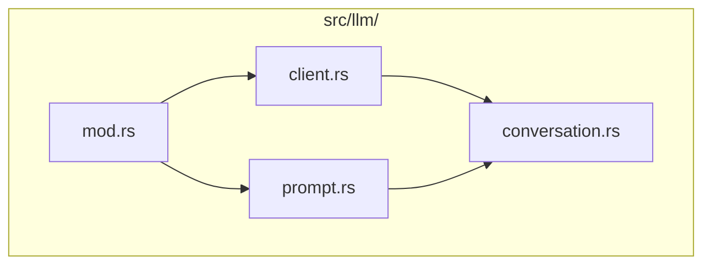
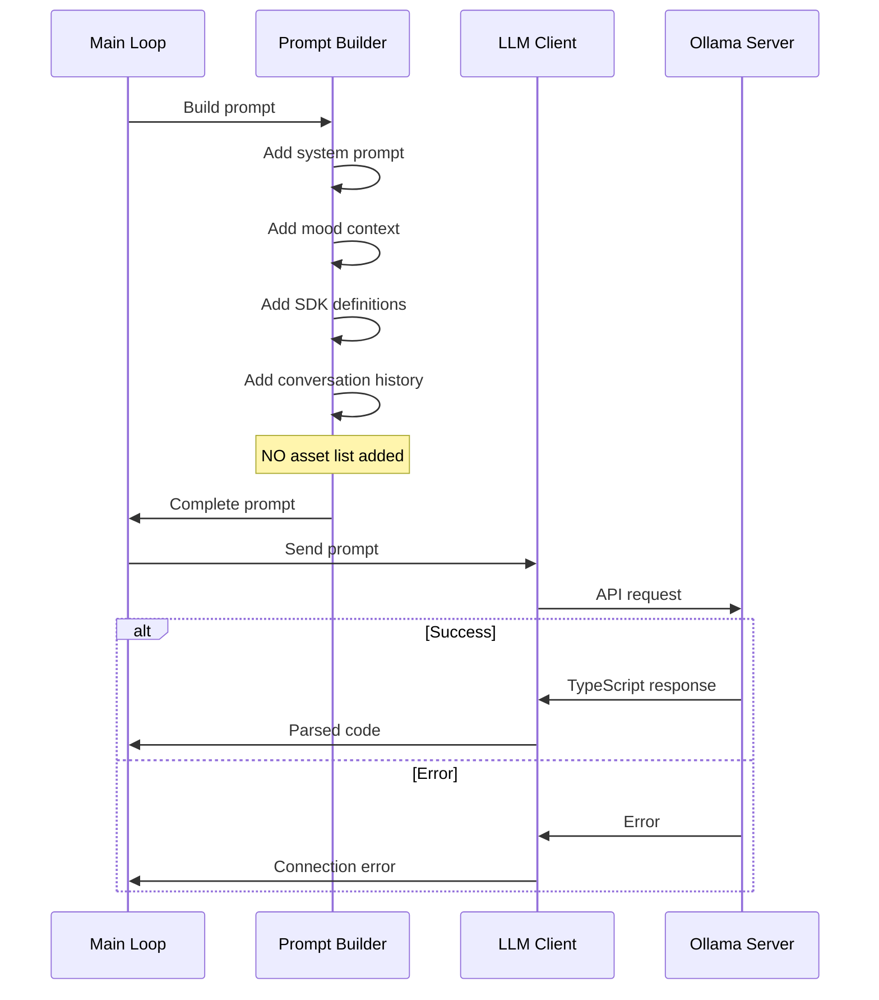
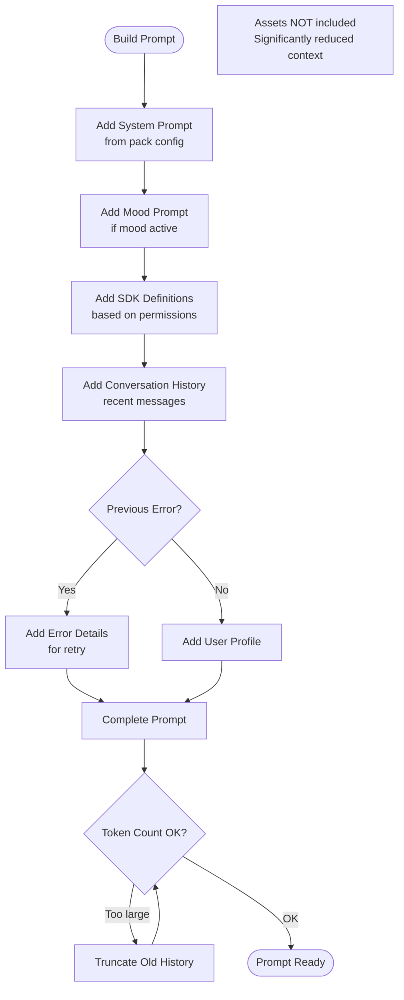
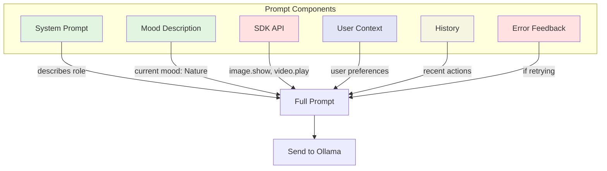
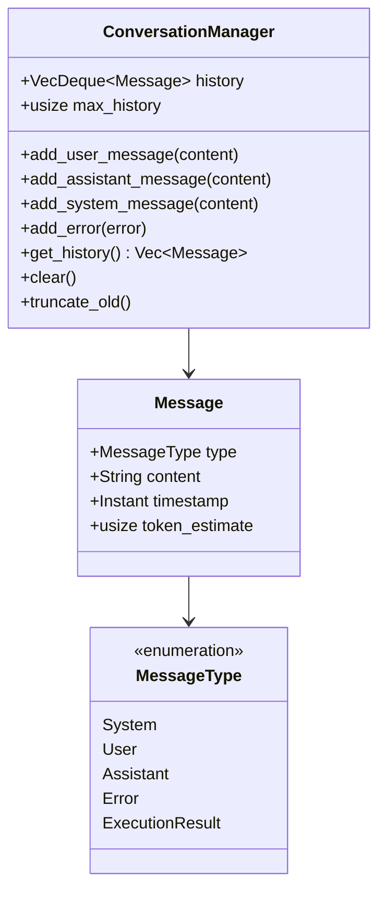
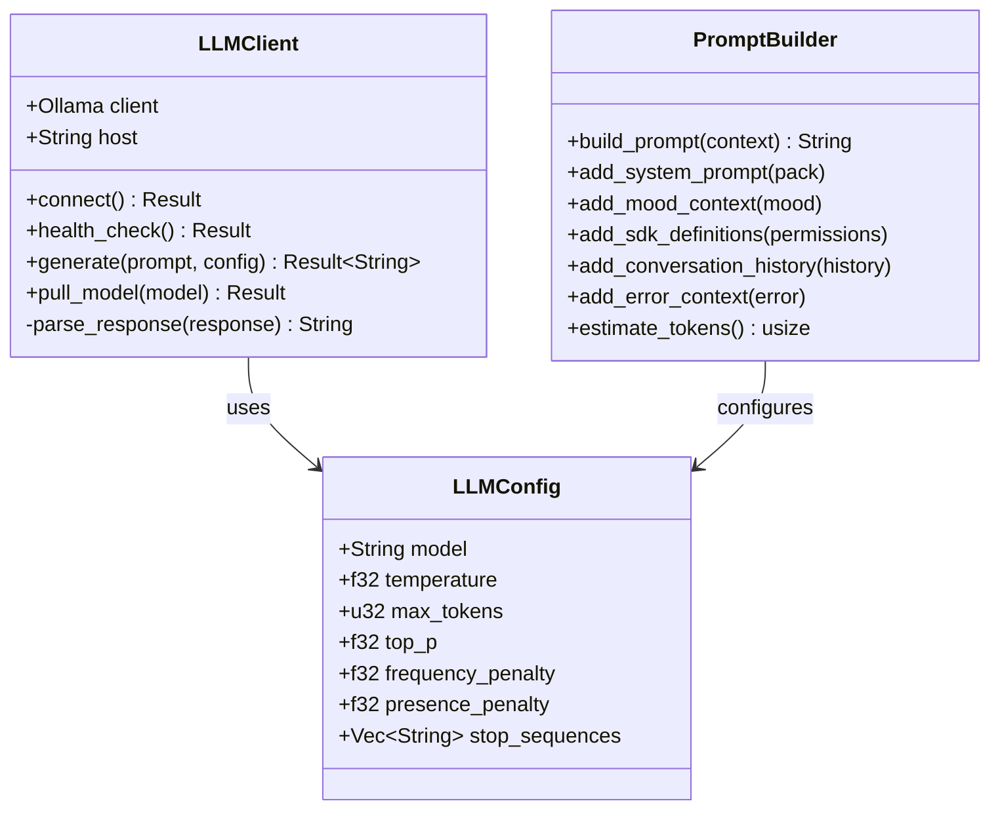
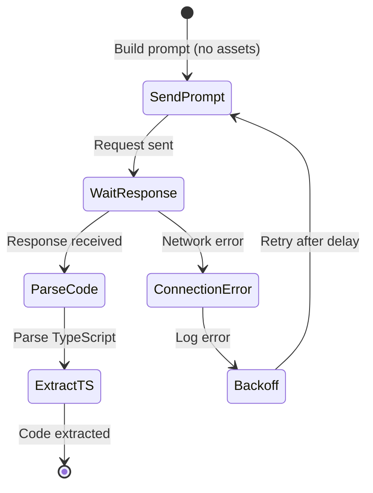
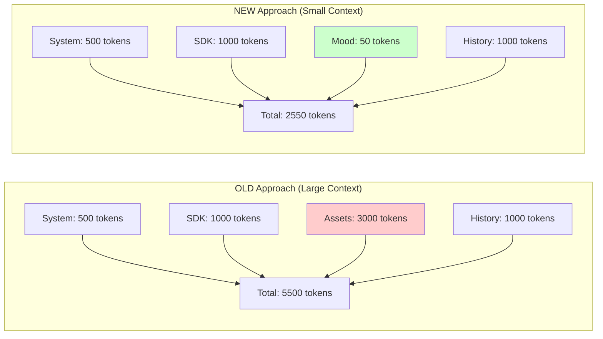

## Objective
Implement LLM integration using ollama-rs to communicate with a local Ollama server, send prompts with SDK definitions, and receive TypeScript code responses. **Assets are NOT included in prompts** to reduce context size.
## Module Structure

## LLM Integration Flow

## Prompt Construction (Simplified - No Assets)

## Prompt Template Structure

## Example Prompt Structure
```markdown
# System Prompt (from pack)
You are an AI assistant designed to help test the functionality of goon.ai.
You can display images, play videos, and play audio using the provided SDK.
# Current Mood
The user's current mood is: **Nature**
Focus on showing content related to nature, landscapes, and outdoor environments.
# Available SDK Functions
```typescript
// Display a random image based on current mood
async function image.show(options?: ImageOptions): Promise<WindowHandle>;
// Play a random video based on current mood
async function video.play(options?: VideoOptions): Promise<WindowHandle>;
// Play random audio based on current mood
async function audio.play(options?: AudioOptions): Promise<AudioHandle>;
// Show text prompt
async function prompt.show(text: string, options?: PromptOptions): Promise<WindowHandle>;
```
# User Profile
Name: Joe Bloggs
Gender: male
# Recent History
[Previous interactions...]
# Your Task
Generate TypeScript code using the SDK functions above to interact with the user.
```
## Conversation Management

## LLM Client Implementation

## Error Retry Flow

## SDK Definitions in Prompt
The LLM receives simple, asset-free API definitions:
```typescript
/**
 * Image display functions
 * Images are automatically selected based on current mood
 */
namespace image {
    /**
     * Show a random image matching the current mood
     * @param options Display options
     * @returns Window handle for the displayed image
     */
    function show(options?: {
        duration?: number;      // Auto-close after seconds
        opacity?: number;       // 0.0 to 1.0
        position?: { x: number; y: number };
        alwaysOnTop?: boolean;
        clickThrough?: boolean;
    }): Promise<WindowHandle>;
}
/**
 * Video playback functions
 * Videos are automatically selected based on current mood
 */
namespace video {
    function play(options?: VideoOptions): Promise<WindowHandle>;
}
// etc...
```
## Tasks
### 1. LLM Module Structure
- [ ] Create LLM module (see diagram)
- [ ] Define module exports
### 2. Ollama Client Setup
- [ ] Implement `LLMClient`
- [ ] Health check/ping
- [ ] Automatic model pulling
### 3. Prompt Construction (Simplified)
- [ ] Build system prompt from pack
- [ ] Add mood description (NOT asset list)
- [ ] Include SDK definitions (filtered by permissions)
- [ ] Add user profile
- [ ] Add conversation history
- [ ] **Exclude asset lists to reduce context**
### 4. Conversation Management
- [ ] Implement conversation history
- [ ] Track messages with types
- [ ] Context window management
- [ ] Truncate old messages
### 5. Request/Response Handling
- [ ] Send requests with pack LLM settings
- [ ] Parse TypeScript from response
- [ ] Extract code blocks
- [ ] Handle markdown formatting
### 6. Error Feedback Loop
- [ ] Format compilation errors for LLM
- [ ] Format runtime errors for LLM
- [ ] Include in next prompt
- [ ] Limit retry attempts
### 7. Dependencies to Add
```toml
[dependencies]
ollama-rs = "0.2"
reqwest = "0.12"
```
### 8. Configuration
- [ ] Support pack LLM settings
- [ ] Model selection
- [ ] Temperature, top_p, etc.
- [ ] Stop sequences
## Context Size Comparison

## Acceptance Criteria
- [ ] Can connect to Ollama server
- [ ] Successfully sends prompts without asset lists
- [ ] Receives and parses TypeScript responses
- [ ] Handles errors and formats them for retry
- [ ] Maintains conversation context
- [ ] Respects pack's LLM configuration
- [ ] Gracefully handles Ollama being offline
- [ ] Context size significantly reduced (no assets)
- [ ] Mood context included in prompts
## Dependencies
```mermaid
graph LR
    Issue2[#2 Core Init] -->|required| This[Issue #4]
    Issue8[#8 Permissions] -->|required| This
    This -->|required by| Issue16[#16 Main Loop
