## Objective
Create a system to generate TypeScript SDK definitions from Rust op implementations with **modular class-based exports** that support the permission system and provide rich handle-based control APIs.
## Module Structure

## SDK Generation Flow with Modular Exports

## Complete SDK Module List

## Complete SDK Type System

## Complete SDK Modules
### Base Types (types.ts)
```typescript
/**
 * Base window handle interface
 */
interface WindowHandle {
    /**
     * Closes the window.
     */
    close(): Promise<void>;
}
/**
 * Position and dimensions for window placement
 */
interface Position {
    /** X coordinate in pixels */
    x: number;
    /** Y coordinate in pixels */
    y: number;
    /** Width in pixels */
    width: number;
    /** Height in pixels */
    height: number;
}
```
### Image Module (image.ts)
```typescript
interface ImageOptions {
    /**
     * Additional tags to filter images by, beyond the mood's tags.
     * Images must match the mood tags AND any specified tags.
     */
    tags?: string[];
    
    /**
     * Coordinates and dimensions for displaying the image.
     * All values are in pixels.
     * If omitted, defaults to the image with its original dimensions randomly placed on the screen.
     * Will be clamped to fit within the screen bounds.
     * Will maintain aspect ratio of the image, by adjusting width or height as necessary.
     */
    position?: {
        x: number;
        y: number;
        width: number;
        height: number;
    };
    
    /**
     * Whether the window can be closed by the user.
     * Default: true
     */
    closable?: boolean;
    
    /**
     * Opacity of the window, from 0 (transparent) to 1 (opaque).
     * Default: 1
     */
    opacity?: number;
    
    /**
     * Time in milliseconds before the window automatically closes.
     * Default: no timeout
     */
    timeout?: number;
}
interface ImageHandle extends WindowHandle {
    /**
     * Sets the opacity of the image window, from 0 (transparent) to 1 (opaque).
     */
    setOpacity(opacity: number): Promise<void>;
    
    /**
     * Moves the image window to the specified (x, y) coordinates.
     */
    moveTo(x: number, y: number): Promise<void>;
    
    /**
     * Resizes the image window to the specified width and height.
     * Maintains aspect ratio if needed.
     */
    resize(width: number, height: number): Promise<void>;
}
/**
 * Image display functions
 */
class image {
    /**
     * Display an image from the pack's assets.
     * The image is automatically selected based on current mood and optional tags.
     */
    static async show(options: ImageOptions): Promise<ImageHandle>;
}
```
### Video Module (video.ts)
```typescript
interface VideoOptions {
    /**
     * Additional tags to filter videos by, beyond the mood's tags.
     */
    tags?: string[];
    
    /**
     * Coordinates and dimensions for displaying the video.
     */
    position?: {
        x: number;
        y: number;
        width: number;
        height: number;
    };
    
    /**
     * Whether the window can be closed by the user.
     * Default: true
     */
    closable?: boolean;
    
    /**
     * Opacity of the window, from 0 (transparent) to 1 (opaque).
     * Default: 1
     */
    opacity?: number;
    
    /**
     * Time in milliseconds before the window automatically closes.
     * Default: no timeout
     */
    timeout?: number;
    
    /**
     * Volume level from 0 (muted) to 1 (maximum).
     * Default: 1
     */
    volume?: number;
    
    /**
     * Whether to loop the video.
     * Default: false
     */
    loop?: boolean;
}
interface VideoHandle extends WindowHandle {
    setOpacity(opacity: number): Promise<void>;
    moveTo(x: number, y: number): Promise<void>;
    resize(width: number, height: number): Promise<void>;
    setVolume(volume: number): Promise<void>;
    loop(loop: boolean): Promise<void>;
}
class video {
    static async play(options: VideoOptions): Promise<VideoHandle>;
}
```
### Audio Module (audio.ts)
```typescript
interface AudioOptions {
    /**
     * Additional tags to filter audio by, beyond the mood's tags.
     */
    tags?: string[];
    
    /**
     * Volume level from 0 (muted) to 1 (maximum).
     * Default: 1
     */
    volume?: number;
    
    /**
     * Whether to loop the audio.
     * Default: false
     */
    loop?: boolean;
}
interface AudioHandle {
    stop(): Promise<void>;
    setVolume(volume: number): Promise<void>;
    loop(loop: boolean): Promise<void>;
}
class audio {
    static async play(options: AudioOptions): Promise<AudioHandle>;
}
```
### Text Prompt Module (textPrompt.ts)
```typescript
/**
 * Text prompt with optional image display
 */
class textPrompt {
    /**
     * Displays a text prompt in a window, with optional image.
     * The window will close when the user has copied the text into the prompt window.
     * 
     * Note: This ignores the following ImageOptions properties:
     * - position: Always centers the window on screen
     * - timeout: Window remains until user copies text
     * - closable: Window only closes when user copies text
     * 
     * The image will be displayed below the text if provided.
     * 
     * @param text The text to display
     * @param image Optional image options (position, timeout, closable ignored)
     * @returns Window handle
     * 
     * @example
     * // Simple text prompt
     * await textPrompt.show("Take a deep breath and relax...");
     * 
     * @example
     * // Text prompt with mood-based image
     * await textPrompt.show(
     *   "Focus on this image and breathe slowly...",
     *   { tags: ['calming', 'nature'], opacity: 0.9 }
     * );
     */
    static async show(text: string, image?: ImageOptions): Promise<WindowHandle>;
}
```
### Wallpaper Module (wallpaper.ts)
```typescript
/**
 * Desktop wallpaper functions
 */
class wallpaper {
    /**
     * Sets the desktop wallpaper to an image matching the specified mood and tags.
     * The image is automatically selected based on:
     * 1. Current mood's tags
     * 2. Additional tags specified (if any)
     * 
     * @param tags Optional additional tags to filter wallpapers
     * 
     * @example
     * // Set wallpaper from current mood
     * await wallpaper.set();
     * 
     * @example
     * // Set wallpaper with specific tags
     * await wallpaper.set(['mountain', 'sunset']);
     */
    static async set(tags?: string[]): Promise<void>;
}
```
### Website Module (website.ts)
```typescript
/**
 * Web browser functions
 */
class website {
    /**
     * Opens a website in the default browser matching the specified mood and tags.
     * Websites are defined in the pack configuration and filtered by:
     * 1. Current mood's tags
     * 2. Additional tags specified (if any)
     * 
     * @param tags Optional tags to filter websites
     * 
     * @example
     * // Open website from current mood
     * await website.open();
     * 
     * @example
     * // Open conservation-related website
     * await website.open(['conservation', 'nature']);
     */
    static async open(tags?: string[]): Promise<void>;
}
```
### Pack Module (pack.ts) - Always Included
```typescript
/**
 * Mood information
 */
interface Mood {
    /** Name of the mood */
    name: string;
    
    /** Description of the mood */
    description: string;
    
    /** Tags associated with the mood */
    tags: string[];
}
/**
 * Pack and mood management functions
 * Note: Moods are included in the LLM prompt for context
 */
class pack {
    /**
     * Gets the current mood for the pack.
     * This determines which assets are selected by default.
     * 
     * @returns The current mood
     * 
     * @example
     * const currentMood = await pack.getCurrentMood();
     * console.log(`Current mood: ${currentMood.name}`);
     * console.log(`Tags: ${currentMood.tags.join(', ')}`);
     */
    static async getCurrentMood(): Promise<Mood>;
    
    /**
     * Sets the current mood for the pack.
     * This will affect which assets are selected for all subsequent operations.
     * 
     * @param mood_name Name of the mood to activate
     * 
     * @example
     * // Switch to relaxation mode
     * await pack.setMood("Nature");
     * 
     * // Now all asset selection will use "Nature" mood tags
     * await image.show({}); // Will show nature-themed images
     */
    static async setMood(mood_name: string): Promise<void>;
}
```
### Index Module (index.ts) - Permission-Based
```typescript
// This file is automatically generated based on active permissions
// Base types (always included)
export * from './types';
// Pack management (always included)
export * from './pack';
// Conditionally exported based on permissions
export * from './image';      // Only if 'image' permission granted
export * from './video';      // Only if 'video' permission granted
export * from './audio';      // Only if 'audio' permission granted
export * from './textPrompt'; // Only if 'prompt' permission granted
export * from './wallpaper';  // Only if 'wallpaper' permission granted
export * from './website';    // Only if 'website' permission granted
```
## LLM Prompt Context
The moods will be included in the LLM prompt for context:
```markdown
# Available Moods
The pack has the following moods available:
## Nature
Description: Images and media related to natural landscapes and environments.
Tags: nature, landscape, outdoor
## Animals
Description: Media featuring various animals in different settings.
Tags: animal
## Spirals
Description: Hypnotic spiral animations for relaxation and focus.
Tags: spiral
# Current Mood
The current mood is: **Nature**
You can use `pack.getCurrentMood()` and `pack.setMood(name)` to manage moods.
```
## Permission Mapping

```mermaid
graph TB
    subgraph "Permissions → SDK Modules"
        P1[image permission] -->|enables| M1[image.ts]
        P2[video permission] -->|enables| M2[video.ts]
        P3[audio permission] -->|enables| M3[audio.ts]
        P4[prompt permission] -->|enables| M4[textPrompt.ts]
        P5[wallpaper permission] -->|enables| M5[wallpaper.ts]
        P6[website permission] -->|enables| M6[website.ts]
        
        Always[Always Enabled] -->|always| M7[pack.ts]
        Always -->|always| M8[types.ts]
    end
```

## Tasks
### 1. SDK Module Structure
- [ ] Create SDK generation module
- [ ] Support modular TypeScript output
- [ ] Generate separate files per permission
### 2. Type System Generation
- [ ] Generate base types (WindowHandle, Position, Mood)
- [ ] Generate options interfaces
- [ ] Generate handle interfaces with methods
- [ ] Generate class declarations
### 3. Modular Export System
- [ ] Generate separate .ts file per SDK module
- [ ] Generate index.ts with conditional exports
- [ ] Filter exports based on active permissions
- [ ] Always include pack.ts and types.ts
- [ ] Ensure type safety across modules
### 4. Additional Modules
- [ ] Generate textPrompt.ts module
- [ ] Generate wallpaper.ts module
- [ ] Generate website.ts module
- [ ] Generate pack.ts module (always included)
- [ ] Document special behaviors (textPrompt ignoring properties)
### 5. Handle Method Support
- [ ] Map handle methods to separate ops
- [ ] Generate method signatures on handle interfaces
- [ ] Track handle lifecycle
- [ ] UUID-based handle identification
### 6. Tag Filtering Support
- [ ] Document optional tags parameter for all applicable functions
- [ ] Document mood + tags combination behavior
- [ ] Clear documentation of filtering behavior
### 7. Pack Management
- [ ] Implement getCurrentMood() op
- [ ] Implement setMood() op
- [ ] Include mood information in LLM prompt
- [ ] Document mood effects on asset selection
### 8. Class-Based API
- [ ] Generate static class methods
- [ ] Proper TypeScript class syntax
- [ ] JSDoc comments on classes and methods
- [ ] Usage examples for each class
### 9. Dependencies to Add
```toml
[dependencies]
uuid = { version = "1", features = ["v4", "serde"] }
```
## Complete SDK Usage Examples
```typescript
// Example 1: Basic image display
const img = await image.show({ 
    tags: ['beach', 'sunny'],
    opacity: 0.9 
});
// Example 2: Video with position and loop
const vid = await video.play({
    tags: ['nature', 'calming'],
    position: { x: 100, y: 100, width: 800, height: 600 },
    loop: true,
    volume: 0.7
});
// Example 3: Audio playback
const audio_handle = await audio.play({
    tags: ['ambient'],
    volume: 0.5,
    loop: true
});
// Example 4: Text prompt with image
await textPrompt.show(
    "Take a moment to focus on your breathing...",
    { tags: ['calming'], opacity: 0.85 }
);
// Example 5: Set wallpaper
await wallpaper.set(['mountain', 'sunset']);
// Example 6: Open website
await website.open(['conservation']);
// Example 7: Mood management
const mood = await pack.getCurrentMood();
console.log(`Current: ${mood.name}, Tags: ${mood.tags.join(', ')}`);
await pack.setMood("Animals");
// Now all operations use "Animals" mood
// Example 8: Handle control
const img = await image.show({});
await img.setOpacity(0.5);
await img.moveTo(200, 200);
await img.resize(400, 300);
await img.close();
```
## Acceptance Criteria
- [ ] SDK is modular with separate files per permission
- [ ] TypeScript definitions are syntactically valid
- [ ] Only permitted modules are exported
- [ ] pack.ts is always exported
- [ ] Handle interfaces include control methods
- [ ] Optional tags parameter documented
- [ ] textPrompt special behaviors documented
- [ ] Mood information included in LLM prompt
- [ ] Class-based API with static methods
- [ ] JSDoc comments are comprehensive
- [ ] Examples show real usage patterns
- [ ] Compiles successfully with SWC
## Dependencies
```mermaid
graph LR
    Issue6[#6 deno_core] -->|required| This[Issue #7]
    Issue8[#8 Permissions] -->|required| This
    This -->|required by| Issue4[#4 LLM Prompts]
    This -->|required by| Issue5[#5 TypeScript